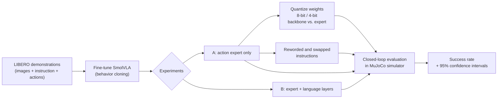

# SmallHands: Compressing and Stress-Testing Vision-Language-Action Robot Policies

**How small can a robot's "brain" get before it stops working, and does it actually listen to what you tell it?**

`Status: in progress` · `PyTorch` · `LeRobot` · `Hugging Face` · `MuJoCo` · `SmolVLA` · `LIBERO`

## TL;DR

Vision-Language-Action (VLA) models take a camera image and a natural-language instruction ("pick up the soup and put it in the basket") and output robot motor commands. They are powerful but large, which makes them hard to deploy on the fixed, latency-constrained hardware real robots use.

SmallHands studies a compact open VLA, **SmolVLA (~450M parameters)**, on the **LIBERO** simulated manipulation benchmark and asks three questions:

| # | Question | Why it matters |

| 1 | **Fine-tuning:** is training only the small action module enough, or does adapting the language layers help? | Cheaper training with less risk of overwriting pretrained knowledge |
| 2 | **Compression:** how much task success survives 8-bit and 4-bit weights, and which part of the model is most sensitive? | Tells you what can be compressed for deployment and what can't |
| 3 | **Language grounding:** does the robot still succeed when instructions are reworded, and does it *fail* when given the wrong instruction? | Distinguishes a policy that understands language from one that ignores it |

## Progress

- [x] Evaluation pipeline built and validated (see below)
- [x] Training pipeline built; throughput benchmarked on an NVIDIA L4
- [x] Quantization, paraphrase, and results tooling implemented with unit tests
- [x] Automatic checkpoint backup/restore so training survives cloud-session disconnects
- [ ] Experiment A: train the action expert only *(running)*
- [ ] Experiment B: action expert + language layers
- [ ] Quantization sweep (8-bit / 4-bit, by model component)
- [ ] Instruction-robustness evaluation with swapped-instruction control
- [ ] Final write-up with results and rollout videos

### Pipeline validation

Before training anything, I verified the closed-loop evaluation setup by running a publicly available pretrained SmolVLA LIBERO checkpoint through it. It succeeded on **9 of 10 LIBERO-Object tasks** (one episode per task), confirming that rendering, camera inputs, and the action space are wired correctly.

> This is a sanity check of the pipeline using someone else's model, not a result of this project. With only 10 episodes the 95% confidence interval is wide (about 60–98%).

## Approach

**Model.** SmolVLA pairs a pretrained vision-language model (SmolVLM2) with a small transformer "action expert" that generates chunks of future actions using flow matching.

**Training.** Behavior cloning on LIBERO's human demonstrations with Hugging Face LeRobot. Both experiments use the same seed, step count, and batch size, so exactly one variable changes between them.

**Evaluation.** Every number comes from **closed-loop rollouts** in the simulator: the policy's own actions change the scene, and an episode counts only if the task is completed. Training loss alone doesn't predict this.

**Quantization.** Simulated weight-only quantization (symmetric; per-channel at 8-bit, group-wise with group size 128 at 4-bit), applied separately to the vision-language backbone and the action expert. This isolates the *accuracy* cost of low-bit weights; memory savings are reported as estimates of N-bit storage, not measured speed-ups.

**Language robustness.** Instructions are swapped for paraphrases just before tokenization, at several levels (synonyms, restructured sentences, verbose phrasing). A **swapped-instruction control** gives each task another task's instruction: if success barely drops, the policy is recognizing tasks from the scene rather than following language. Every rewrite is logged and verified, so a run that silently changed nothing can't be mistaken for a robust result.

## Results

*Will be filled in as experiments complete. All numbers will come from my own runs, with 95% Wilson confidence intervals.*

| Experiment | Success % (95% CI) | Notes |
|---|---|---|
| A: action expert only | 65.0 [55.3, 73.6] | 100 episodes · 20k steps · batch 32 · ~5 h on one L4 |
| B: expert + language layers | pending | |
| A + 8-bit weights | pending | |
| A + 4-bit backbone only | pending | |
| A + 4-bit action expert only | pending | |
| A, reworded instructions | pending | |
| A, swapped instructions (control) | pending | low = policy uses language |

## Engineering highlights

- **Non-invasive experiment hooks.** Quantization and instruction rewriting are injected into LeRobot's own evaluation loop by wrapping two factory functions, so every configuration is measured with identical rollout and scoring code.
- **Fail-loud checks.** The quantizer refuses to run if its module filter matches nothing, and the paraphrase hook warns if no instruction was rewritten. Both prevent silent no-op runs from looking like positive results.
- **Statistical honesty.** Results carry Wilson confidence intervals, and differences inside overlapping intervals are reported as within noise.
- **Resilient cloud training.** Checkpoints are pruned locally and backed up to a private Hugging Face repo every 15 minutes, and a new session restores and resumes automatically. A run can move between Google Colab (training) and Kaggle (evaluation).
- **Reproducibility.** The LeRobot commit is pinned on first run and reused afterwards; all LeRobot imports live in one compatibility module.

## Limitations

Simulation only; one benchmark suite (LIBERO-Object); one training seed per configuration; simulated quantization measures accuracy, not real latency.

## Acknowledgements

Built on [LeRobot](https://github.com/huggingface/lerobot), [SmolVLA](https://arxiv.org/abs/2506.01844), and [LIBERO](https://libero-project.github.io/).

**Archita** · M.S. Artificial Intelligence, Northeastern University · archita.l@northeastern.edu · [LinkedIn](https://www.linkedin.com/in/YOUR-PROFILE)
