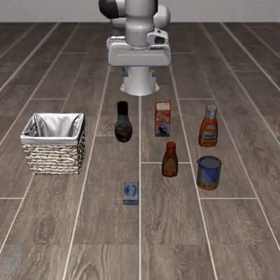
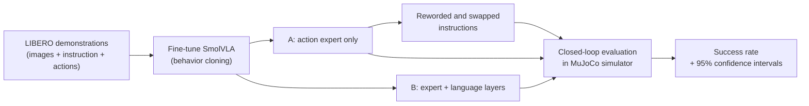

# SmallHands: Fine-Tuning and Stress-Testing a Vision-Language-Action Robot Policy

**Does a robot that follows instructions actually understand them?**

`PyTorch` · `LeRobot` · `Hugging Face` · `LIBERO (MuJoCo)` · `SmolVLA`

<p align="center">
  
  
</p>
<p align="center"><em>Same model, same scene. Left: "pick up the ketchup and place it in the basket" (success). Right: "put the ketchup into the basket" (failure).</em></p>


---

## TL;DR

Vision-Language-Action (VLA) models take camera images and a natural-language instruction and output robot motor commands. I fine-tuned **SmolVLA**, a compact open VLA with about 450M parameters, on the **LIBERO** simulated manipulation benchmark, evaluated it closed-loop in a physics simulator, and ran three controlled experiments.

| Finding | Evidence |
|---|---|
| **1. Freezing the pretrained backbone was enough.** Also training the language layers fit the data better but did not make the robot succeed more often. | 65% vs. 58% task success (difference within confidence intervals), despite lower training loss (0.32 vs. 0.35) |
| **2. The policy does use language.** Given the wrong object, it fails. | Success drops from 66% to **6%** |
| **3. But it does not understand the meaning.** Simply rewording a *correct* instruction breaks it. | Synonyms: **26%**. Restructured or polite phrasing: **0%** |

The robot follows the **exact sentence it was trained on**, not what the sentence means. A rephrased correct instruction did worse than a wrong instruction in familiar wording.

---

## Results

All numbers come from closed-loop rollouts in the LIBERO-Object suite (10 tasks, up to 280 steps per episode), with 95% confidence intervals.

### Experiment 1: what to fine-tune

| Model | Trained parts | Success % (95% CI) | Episodes | Final training loss |
|---|---|---|---|---|
| **A** | Action expert only (backbone frozen) | **65.0** [55.3, 73.6] | 100 | 0.35 |
| **B** | Action expert + language layers | **58.0** [48.2, 67.2] | 100 | 0.32 |

Both runs used the same data, 20,000 steps, batch size 32, and the same random seed, so only one variable changed. B fit the demonstrations more closely but did not perform better closed-loop. The difference is not statistically significant (two-proportion test, p ≈ 0.3), so the cheaper configuration, A, was used for the remaining experiments.

### Experiment 2: does the policy understand instructions?

Model A was evaluated with the same scenes and starting states; only the instruction text changed.

| Instruction given | Example | Success % (95% CI) |
|---|---|---|
| **Original** (training wording) | *pick up the ketchup and place it in the basket* | **66.0** [52.2, 77.6] |
| **Synonyms** | *grab the ketchup and put it in the basket* | **26.0** [15.9, 39.6] |
| **Restructured** | *put the ketchup into the basket* | **0.0** [0.0, 7.1] |
| **Verbose / polite** | *could you please pick up the ketchup and place it in the basket for me?* | **0.0** [0.0, 7.1] |
| **Swapped** (control: another task's instruction) | *pick up the tomato sauce and place it in the basket* | **6.0** [2.1, 16.2] |

50 episodes per condition (5 per task). Every rewrite was logged and verified; the "original" condition matching Experiment 1 (66% vs. 65%) confirms that the rewriting mechanism itself does not change behavior.

**How to read this:**
- If paraphrases had kept success high, that alone could have meant either real language understanding *or* a policy that ignores language. The **swapped control** separates the two: success collapsing to 6% shows the instruction genuinely drives behavior.
- Yet correct instructions in new wording failed as badly as wrong ones, or worse. The policy has learned to respond to specific word patterns, not their meaning.

**Likely cause (hypothesis, not yet tested):** LIBERO provides a single fixed sentence per task. The pretrained backbone still understands English, but the action expert, the only part trained in model A, never saw any variation in wording and learned to react to those exact token patterns.

**Why it matters:** a robot that fails when someone says "grab" instead of "pick up" is not ready to take instructions from people. Weaknesses like this need to be found in simulation, before deployment, especially in safety-critical settings.

---

## Approach



**Model.** SmolVLA pairs a pretrained vision-language model (SmolVLM2, first 16 layers, ~301M parameters) with a smaller transformer "action expert" (~98M parameters). The action expert uses **flow matching** to generate **chunks of 50 future actions** at a time: smooth motion, and far fewer model calls per episode.

**Training.** Behavior cloning on LIBERO's human demonstrations (all four suites, about 270k frames) with Hugging Face LeRobot. 20,000 steps at batch size 32, about 5 hours per model on one NVIDIA L4.

**Evaluation.** Every number comes from **closed-loop rollouts**: the policy's own actions change the scene, and an episode counts only if the benchmark's goal condition is met (e.g., the ketchup is inside the basket). Training loss is measured open-loop on human trajectories and does not capture compounding errors, which Experiment 1 illustrates directly.

**Instruction rewriting.** Instructions are replaced just before tokenization by wrapping LeRobot's preprocessing step, so the rollout and scoring code is identical across all conditions. The hook counts every rewrite and warns if none occurred, so a silent no-op cannot be mistaken for a robustness result.

**Statistics.** Each success rate carries a 95% confidence interval; differences inside overlapping intervals are reported as inconclusive.

---

## Engineering highlights

- **Non-invasive experiment hooks.** Interventions are injected into LeRobot's own evaluation loop rather than reimplementing it, keeping every condition directly comparable.
- **Validate before training.** Before training anything, I ran a public pretrained SmolVLA checkpoint through the pipeline (9 of 10 tasks succeeded) to confirm rendering, camera inputs and the action space were wired correctly.
- **Resilient cloud training.** Checkpoints are saved every 1,000 steps and backed up to a private Hugging Face repository every 15 minutes; a new session restores them and resumes automatically. Work moved between Google Colab (training) and Kaggle (evaluation) through the same backup.
- **Reproducibility.** The LeRobot commit is pinned on first run, all LeRobot imports live in one compatibility module, and unit tests cover the analysis code.

---

## Limitations

- Simulation only, on a single LIBERO suite (LIBERO-Object).
- One training seed per configuration.
- 100 episodes for Experiment 1 and 50 per condition for Experiment 2, so the intervals are fairly wide.
- 20k training steps, shorter than the published SmolVLA training budget; absolute success rates would likely rise with longer training.
- The explanation for the paraphrase failures is a hypothesis and has not been tested.

## Future work

- **Paraphrase augmentation:** train with varied instruction wording and test whether robustness improves. This directly tests the hypothesis above.
- More seeds and episodes, to tighten the confidence intervals.
- Harder suites, such as LIBERO-Long (multi-step tasks).
- **Model compression:** weight-quantization tooling is implemented in this repository (`vla_study/quantize.py`) but has not been evaluated.

---

## Repository layout

```
scripts/               one shell script per experiment stage (00 → 07)
vla_study/
  patched_eval.py      evaluation wrapper: rewrites instructions (and optionally quantizes)
  paraphrase.py        extracts LIBERO instructions; builds paraphrase and control sets
  results.py           aggregates evaluations into tables with confidence intervals
  hub_sync.py          checkpoint backup / restore / pruning via Hugging Face Hub
  lerobot_compat.py    all LeRobot imports in one place
  quantize.py          weight-quantization tooling (future work)
  offline_bench.py     simulator-free quantization screening (future work)
tests/                 unit tests (no GPU needed)
vla_study_colab.ipynb  end-to-end notebook for Google Colab (L4 / A100)
vla_study_kaggle.ipynb end-to-end notebook for Kaggle (T4)
```

## Reproduce

The easiest route is a notebook: open `vla_study_colab.ipynb` in Google Colab with an L4 or A100 GPU (or `vla_study_kaggle.ipynb` on Kaggle with a T4), set the stages in the CONFIG cell, and run all. Stages run in this order: `baseline_smoke` → `train_A` → `train_B` → `eval_trained` → `paraphrase_generate` → `paraphrase_eval`.

On a machine with an NVIDIA GPU and Python 3.12+:

```bash
bash scripts/00_setup.sh                 # environment; records the LeRobot commit
bash scripts/01_eval_baseline.sh         # sanity check with a pretrained checkpoint
bash scripts/02_train_expert_only.sh     # model A
bash scripts/03_train_expert_plus_vlm.sh # model B
bash scripts/04_eval_trained.sh          # Experiment 1
bash scripts/06_paraphrase_sweep.sh      # Experiment 2
python -m pytest tests -q
```

## Acknowledgements

Built on [LeRobot](https://github.com/huggingface/lerobot), [SmolVLA](https://arxiv.org/abs/2506.01844) and [LIBERO](https://libero-project.github.io/).

---

**Archita** · M.S. Artificial Intelligence, Northeastern University · archita.l@northeastern.edu · [LinkedIn](https://www.linkedin.com/in/YOUR-PROFILE)

<!--
Adding the videos:
1. On huggingface.co/arckive71/vla-study-runs, download one success video from eval/20_para_original/videos/
   and the SAME task's video from eval/20_para_restruct/videos/ (same folder name, e.g. libero_object_4, same episode number).
2. Convert each .mp4 to a GIF (e.g. ezgif.com/video-to-gif, width about 320 px, keep it under 5 MB).
3. Save them in this repo as assets/success.gif and assets/restruct_fail.gif, then uncomment the block at the top.
-->
